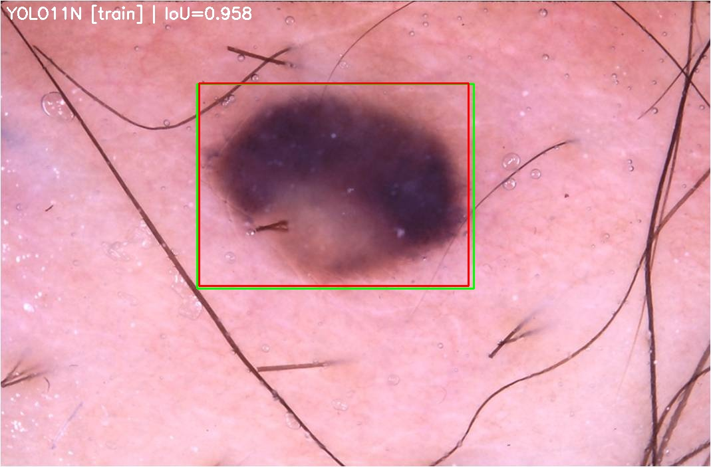

# YOLO-SkinLesion-Localization-ISIC

Automated skin-lesion localization with the YOLO family (v8n–v11n) on the ISIC dataset.

**Authors:** Hamed Aghapanaah, Fatemeh Gol Mohammadi  
**Status:** Thesis code & results (research)

---

## 1) Overview
This repository evaluates YOLOv8n, YOLOv10n and YOLOv11n for **localizing dermoscopic lesions**.  
The pipeline downloads YOLO weights, builds YOLO-format dataset from ISIC images + masks, trains each model, validates best checkpoints, and visualizes results.

---

## 2) Environment & Installation
```bash
pip install ultralytics==8.* torch torchvision torchaudio opencv-python numpy pandas matplotlib tqdm
```

(Optional GPU version)
```bash
pip install torch torchvision torchaudio --index-url https://download.pytorch.org/whl/cu121
```

---

## 3) Dataset (ISIC)
Download **ISIC 2017 Training Data** and **Part 1 Ground Truth** from:
https://challenge.isic-archive.com/data/

Required structure:
```
DATASET/
├── ISIC-2017_Training_Data/
└── ISIC-2017_Training_Part1_GroundTruth/
```

---

## 4) Run the Pipeline
```bash
python yolo_final.py
```
Outputs will be stored under `YOLO_output/` including dataset splits, model results, and comparison tables.

---


## 5) Example Images

### Training Curves


### Sample Detections (YOLOv11n)
|  |  |  |
|:--:|:--:|:--:|
| *ISIC_0000177* | *ISIC_0000360* | *ISIC_0009930* |

### Dataset Visualization
|  |  |  |
|:--:|:--:|:--:|
| *Train Batch* | *Val Labels* | *Val Predictions* |

---

## 6) Results Summary
| Model   | Precision | Recall | mAP50 | mAP50-95 |
|----------|-----------|--------|-------|----------|
| YOLOv8n | 0.980 | 0.992 | 0.994 | 0.833 |
| YOLOv10n | 0.996 | 0.944 | 0.971 | 0.823 |
| YOLOv11n | 0.996 | 0.988 | 0.993 | 0.837 |

---

## 7) Citation
Aghapanaah, H., & Gol Mohammadi, F. (2025).  
*Evaluation of YOLO Family for Skin Lesion Localization on the ISIC Dataset.*
